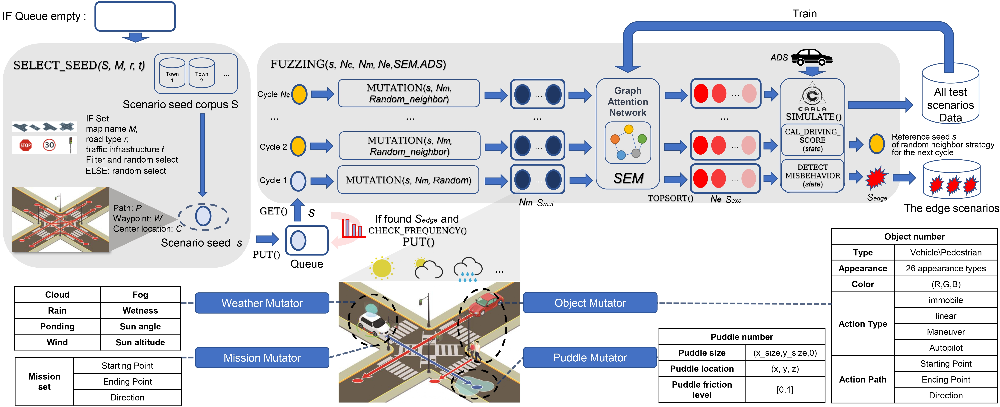

English | [简体中文](README_CN.md) [](https://doi.org/10.5281/zenodo.12633908)

# ScenarioFuzz



## Introduction
ScenarioFuzz is a framework that focuses on conducting fuzz testing on autonomous driving systems at the scenario level. The framework utilizes the following approaches:

1. Leveraging map crawling techniques to construct a topological graph from road semantic web maps based on the OPENDRIVE format. It clusters scene-relevant waypoints and queries waypoint connectivity to build a scenario seed corpus.

2. Based on the scenario seed corpus, the framework mutates the seed scenarios to generate realistic and effective scenario instances.

3. The mutated seed scenarios are evaluated and filtered using a scenario evaluation model, which helps reduce trial-and-error costs.

4. The constructed scenarios are then implemented in the CARLA simulation engine and integrated with the system under test for testing purposes.

5. The framework accurately identifies corner cases in the tested system's scenarios.

6. Multiple iterations of scenario evaluation model training can be performed using the collected test data.

Our experimental results demonstrate that this approach effectively and accurately identifies corner cases in autonomous driving systems, exposing a series of system bugs.

Our paper titled " Dance of the ADS: Orchestrating Failures through Historically-Informed Scenario Fuzzing" has been accepted at ISSTA2024!

## Testing Environment

Our testing environment is as follows:

Single-GPU Setup:
- Hardware
  - CPU: Intel Xeon Gold 5220
  - GPU: Quadro RTX 8000
  - RAM: 128 GB

Multi-GPU Setup:
- Hardware
  - CPU: Intel Xeon Gold 6258R
  - GPU: Tesla V100-SXM2 (*8)
  - RAM: 256 GB

We recommend having a GPU with at least 16 GB of VRAM, as it is involved in the construction of simulation scenarios and the execution of the system under test.

- OS & Software
  - Ubuntu 18.04
  - Python 3.7.16

- CARLA
  - Version 0.9.10


## Clone repository

Clone this repository to `~/scenariofuzz`

```
$ git clone xxxxxx
$ cd ~/scenariofuzz
```
## Installation

Please follow [INSTALL.md](./INSTALL.md) to install all required packages.


## Running Scenariofuzz

1. Preparing the Environment

    ```sh
    $ source /opt/ros/melodic/setup.bash
    $ chmod 700 monitor_and_restart_docker.sh monitor_and_restart.sh
    ```

2. Running Fuzzing

   * If you are running on a single GPU

     * If you are using the local CARLA simulator

       ```sh
       $ ./monitor_and_restart.sh
       ```

     * If you are using the Dockerized CARLA simulator

       ```sh
       $ ./monitor_and_restart_docker.sh
       ```

   * If you are running on multiple GPUs

     ```sh
     $ ./run_scenario_fuzz.sh EXP_ID SYSTEM_NAME GPU_ID
     ```

     For example, to execute the first test for Autoware on the first GPU:

     ```sh
     $ ../run_scenario_fuzz.sh 1 autoware 1
     ```

   * Note the following:

     1) You need to modify the `PROJECT_ROOT`, `CARLA_ROOT` and `CACHE_ROOT`paths.

     2) The system under test is configured by modifying the `SYSTEM_NAME`, except for multi-GPU scenarios.
        ('autoware', 'behavior', 'leaderboard-NEAT', 'basic', 'leaderboard-LAV', 'leaderboard-Transfuser')

     3) Whether to use the scenario evaluation model can be modified as follows:

        - To use the scenario evaluation model:
          ```sh
          FUZZER_SCRIPT="./src/fuzzer_eval.py"
          ```

        - To not use the scenario evaluation model:
          ```sh
          FUZZER_SCRIPT="./src/fuzzer.py"
          ```

     4) Modify the parameters related to Fuzzing as follows:

        ```sh
        run_fuzzer() {
          cd ~/scenariofuzz
          $FUZZER_SCRIPT --timeout 20 -t $SYSTEM_NAME -p $SIM_PORT --device cuda:0 -o /workspace2/scenario_fuzz_model_cov \
          --cache-dir /workspace1/fuzzerdata \
          --town all -c 3 -m 3 &
          sleep 5
        }
        ```

        Where:
        ```
        --timeout sets the timeout duration
        -o specifies the output directory
        --cache-dir specifies the cache directory
        --town specifies the city (Town01-05, all)
        -c specifies the maximum number of loops
        -m specifies the size of the mutated population per cycle
        --no-use-seed disables the use of seed in the first cycle
        ```
        Additional parameters you can use:
        ```
        --scenario-lib-dir specifies the directory to store scenario lib data
        -s specifies the seed directory
        --mutation-num specifies the size of the mutated population per cycle
        -d sets the seed number for deterministic mutation (e.g., for replaying)
        -v enables debug mode
        --direction-set enables direction set mode
        -u specifies the hostname of Carla simulation server
        -p specifies the RPC port of Carla simulation server
        -t specifies the target autonomous driving system (basic/behavior/autoware/leaderboard:(Transfuser/NEAT/LAV/))
        -f specifies the functionality to test (general / collision / traction)
        --strategy specifies the input mutation strategy (all / congestion / entropy / instability / trajectory)
        --alarm-time sets the alarm time for timeout if the vehicle is not moving
        --eval-model sets the evaluation model type
        --device specifies the device to run the model (default: cuda:0/1, cpu)
        --no-speed-check disables speed check
        --no-lane-check disables lane check
        --no-crash-check disables crash check
        --no-stuck-check disables stuck check
        --no-red-check disables red light check
        --no-other-check disables other checks
        --single-stage enables single stage mode
        --coverage enables coverage mode
        --save-bag enables saving bag files
        ```

## Map Crawling Techniques

If you want to try generating your own scenario seed corpus or optimizing the code, you can run:

```sh
python scenario_select/map_scenario_generate_choose_way.py
```

The scenario seed corpus is stored in the [scenario_lib](./scenario_lib) folder.


## Scenario Evaluation Model

Our work aims to efficiently reuse historical data by training the model based on the test scenarios and results obtained during the historical scenario testing process.

In this process, you need to:


1. Abstract the historical data-results from the scenario testing process into graph representation data:
    ```sh
    python src/scenario_eval_model/get_data.py
    ```

2. Train the scenario evaluation model:
    ```sh
    python src/scenario_eval_model/train_classfic.py
    ```
3. Evaluate the scenario evaluation model:
 
    ```sh
    python src/scenario_eval_model/eval_classfic_model.py
    ```
4. Integrate the scenario evaluation model into the fuzz testing process by modifying [eval_model_list.py](src/scenario_eval_model/eval_model_list.py).


 
## Results and details

The results and details are available in the paper and [supplementary material](readme_img/supply.pdf).


## References

The repositories of the systems under test can be found at:

1. Autoware: https://github.com/Autoware-AI

2. LAV: https://github.com/dotchen/LAV

3. NEAT: https://github.com/autonomousvision/neat

4. Transfuser: https://github.com/autonomousvision/transfuser

Additional references and acknowledgments:

1. DriveFuzz: https://gitlab.com/s3lab-code/public/drivefuzz

2. ICSE-SAMOTA: https://github.com/MingfeiCheng/ICSE-SAMOTA

