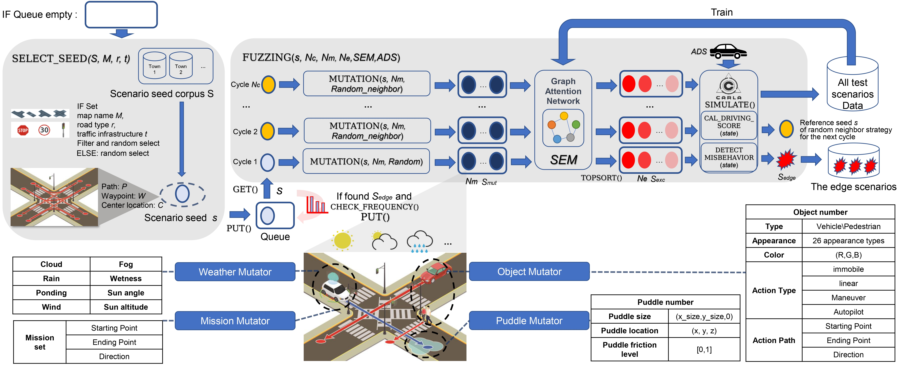

简体中文 | [English](README.md) [](https://doi.org/10.5281/zenodo.12633908)

# ScenarioFuzz



## 简介
ScenarioFuzz 是一个侧重于从场景层面对自动驾驶系统进行模糊测试的框架，该框架通过
1) 利于地图爬取技术从基于OPENDRIVE格式的道路语义网地图构建拓扑图，并通过聚类场景可用路点，查询路点连接关系构建场景种子语料库；
2) 基于场景种子语料库，对场景种子进行变异，生成真实、有效的场景实例；
3) 利用场景评估模型对变异后的种子进行评估筛选，节省试错成本；
4) 在CARLA仿真引擎中构建场景，并接入被测系统进行测试；
5) 准确定位被测系统的角落场景;
6) 在该过程中可利用测试数据对场景评估模型进行多次训练。

我们的实验结果表面，该方法能够高效、准确地识别到自动驾驶系统的角落场景，并暴露出系统的一系列bugs。

我们的论文，" Dance of the ADS: Orchestrating Failures through Historically-Informed Scenario Fuzzing",已被 ISSTA2024 录用。


## Testing environment

我们的实验环境如下：

单卡情况：
* Hardware
  * CPU: Intel Xeon Gold 5220
  * GPU: Quadro RTX 8000
  * RAM: 128 GB
  
多卡情况：
* Hardware
  * CPU: Intel Xeon Gold 6258R
  * GPU: tesla v100-sxm2(*8)
  * RAM: 256 GB

我们建议单卡显存在16G以上，以为涉及到仿真场景的构建与被测系统的运行。

* OS & SW
  * Ubuntu 18.04
  * Python 3.7.16

* CARLA
  * Version 0.9.10


##  克隆项目

克隆代码到`~/scenariofuzz`

```sh
$ git clone xxxxxx
$ cd ~/scenariofuzz
```

## 安装

请参考[INSTALL.md](./INSTALL.md)进行测试环境的安装。

## 运行Scenariofuzz

1. 准备环境

    ```sh
    $ source /opt/ros/melodic/setup.bash
    $ chmod 700 monitor_and_restart_docker.sh monitor_and_restart.sh run_scenario_fuzz.sh
    ```

2. 运行 Fuzzing
  

  * 如果你单卡运行

    * 如果你使用本地端的CARLA模拟器

      ```sh
      $ ./monitor_and_restart.sh
      ```
    * 如果你使用Docker端的CARLA模拟器
      ```sh
      $ ./monitor_and_restart_docker.sh
      ```

  * 如果你多卡运行

     ```sh
     $ ./run_scenario_fuzz.sh EXP_ID SYSTEM_NAME GPU_ID
     ```
    如在1卡执行第1个测试autoware的实验
     ```sh
     $ ../run_scenario_fuzz.sh 1 autoware 1
     ```
   * 注意在其中，

     1) 需要修改`PROJECT_ROOT`,`CARLA_ROOT`, `CACHE_ROOT`路径。

     2) 被测系统的设置通过修改`SYSTEM_NAME`，多卡情况除外。
   
        ('autoware','behavior', 'leaderboard-NEAT', 'basic', 'leaderboard-LAV', 'leaderboard-Transfuser')

     3) 是否使用场景评估模型，通过修改:

        - 使用场景评估模型
           ```sh
           FUZZER_SCRIPT="./src/fuzzer_eval.py"
           ```
       
        - 不使用场景评估模型
           ```sh
           FUZZER_SCRIPT="./src/fuzzer.py"
           ```
       
     4) 修改Fuzzing的相关参数
         ```sh
         run_fuzzer() {
           cd ~/scenariofuzz
           $FUZZER_SCRIPT --timeout 20 -t $SYSTEM_NAME -p $SIM_PORT --device cuda:0 -o /workspace2/scenario_fuzz_model_cov \
           --cache-dir /workspace1/fuzzerdata \
           --town all -c 3 -m 3 &
           sleep 5
         }
         ```
         其中
        ```
        --timeout sets the timeout duration
        -o specifies the output directory
        --cache-dir specifies the cache directory
        --town specifies the city (Town01-05, all)
        -c specifies the maximum number of loops
        -m specifies the size of the mutated population per cycle
        --no-use-seed disables the use of seed in the first cycle
        ```
        以及其他参数的说明，
        ```
        --scenario-lib-dir specifies the directory to store scenario lib data
        -s specifies the seed directory
        --mutation-num specifies the size of the mutated population per cycle
        -d sets the seed number for deterministic mutation (e.g., for replaying)
        -v enables debug mode
        --direction-set enables direction set mode
        -u specifies the hostname of Carla simulation server
        -p specifies the RPC port of Carla simulation server
        -t specifies the target autonomous driving system (basic/behavior/autoware/leaderboard:(Transfuser/NEAT/LAV/))
        -f specifies the functionality to test (general / collision / traction)
        --strategy specifies the input mutation strategy (all / congestion / entropy / instability / trajectory)
        --alarm-time sets the alarm time for timeout if the vehicle is not moving
        --eval-model sets the evaluation model type
        --device specifies the device to run the model (default: cuda:0/1, cpu)
        --no-speed-check disables speed check
        --no-lane-check disables lane check
        --no-crash-check disables crash check
        --no-stuck-check disables stuck check
        --no-red-check disables red light check
        --no-other-check disables other checks
        --single-stage enables single stage mode
        --coverage enables coverage mode
        --save-bag enables saving bag files
        ```
## 地图爬取技术

如果你想尝试自己生成场景种子语料库，或优化代码，可运行：

```sh
python scenario_select/map_scenario_generate_choose_way.py
```
场景种子语料库存储在[scenario_lib](./scenario_lib)文件夹中。

## 场景评估模型

我们的工作旨在高效复用历史数据，基于历史场景测试过程中的测试场景与结果，对该模型进行训练。

在该过程中，需要：

1. 将场景测试过程中的历史数据-结果抽象为图表示数据
    ```sh
    python src/scenario_eval_model/get_data.py
    ```

2. 对场景评估模型进行训练

    ```sh
    python src/scenario_eval_model/train_classfic.py
    ```
3. 对场景评估模型进行评估
 
    ```sh
    python src/scenario_eval_model/eval_classfic_model.py
    ```
4. 将场景评估模型接入到模糊测试过程中，修改[eval_model_list.py](src/scenario_eval_model/eval_model_list.py)


## 结果

结果与详细描述可见论文与[附加材料](readme_img/supply.pdf)。

## 参考

被测系统的repo可见：

1. Autoware: https://github.com/Autoware-AI

2. LAV: https://github.com/dotchen/LAV

3. NEAT: https://github.com/autonomousvision/neat

4. Transfuser: https://github.com/autonomousvision/transfuser
 
参考repo可见：

1. DriveFuzz: https://gitlab.com/s3lab-code/public/drivefuzz

2. ICSE-SAMOTA: https://github.com/MingfeiCheng/ICSE-SAMOTA

## 引用

如果你参考了本文工作，请按照以下格式引用:

```bibtex
@inproceedings{10.1145/3650212.3680344,
  author       = {Wang, Tong and Gu, Taotao and Deng, Huan and Li, Hu and Kuang, Xiaohui and Zhao, Gang},
  title        = {Dance of the ADS: Orchestrating Failures through Historically-Informed Scenario Fuzzing},
  year         = {2024},
  isbn         = {9798400706127},
  publisher    = {Association for Computing Machinery},
  address      = {New York, NY, USA},
  url          = {https://doi.org/10.1145/3650212.3680344},
  doi          = {10.1145/3650212.3680344},
  booktitle    = {Proceedings of the 33rd ACM SIGSOFT International Symposium on Software Testing and Analysis},
  pages        = {1086–1098},
  numpages     = {13},
  keywords     = {Autonomous Driving Systems, Fuzzing, Scenario-based Testing},
  location     = {Vienna, Austria},
  series       = {ISSTA 2024}
}
